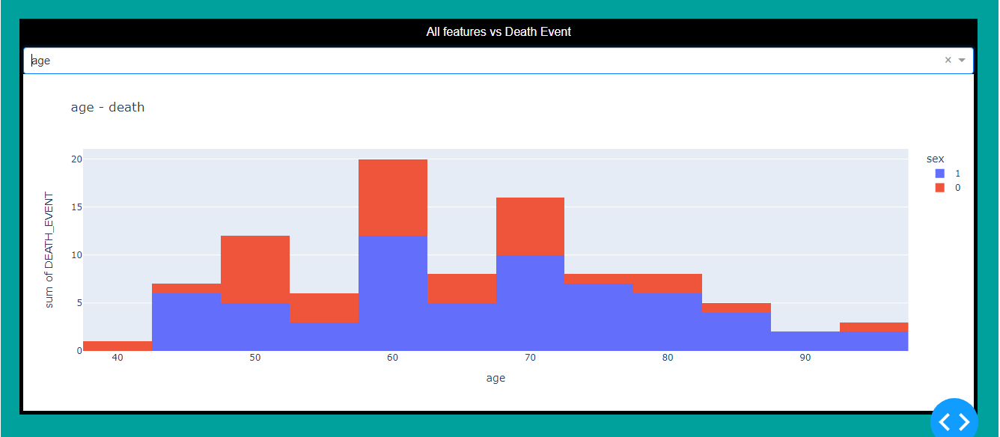
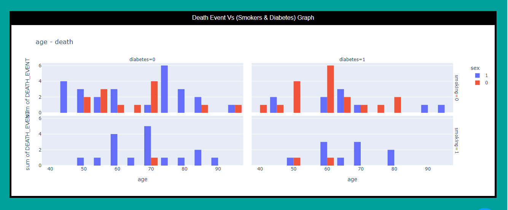
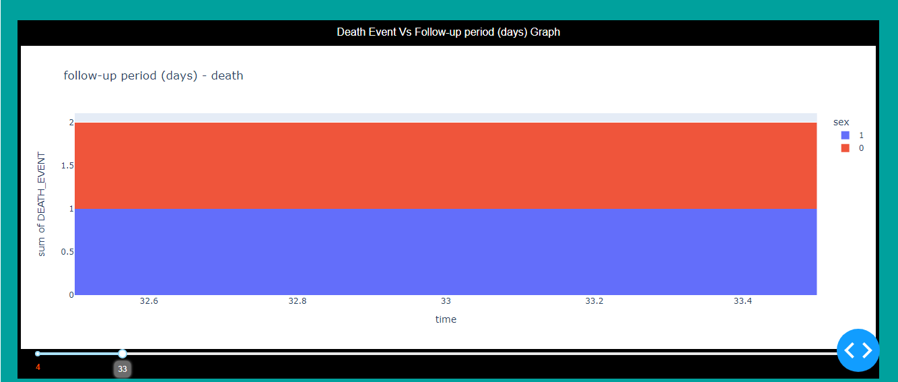

# Data-Visualization
## Heart Failure Predection Visualization

*Dash Data Visualization Project for Heart Failure Prediction

### Requirements : 
* Python
* Dash
* Plotly
* Pandas
* CSS
* HTML
### Images from the project : 

# Dataset :
* https://www.kaggle.com/andrewmvd/heart-failure-clinical-data
